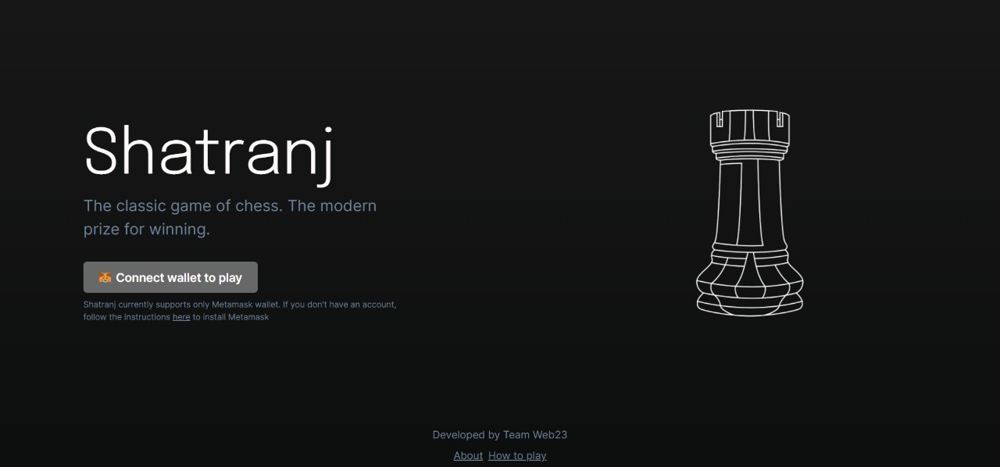
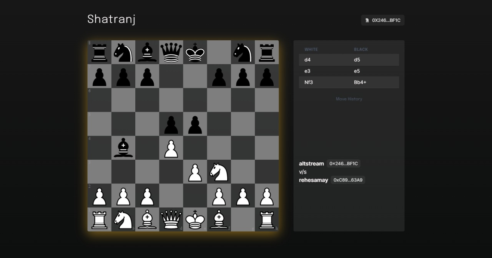

# Shatranj
### The classic game of chess with a modern prize for winning. Play with $ASHF, winner takes it all.
Official submission by **Team Web23** to **[BUIDL IT](https://buidlit.polygon.technology/) Hackathon**.

         

## Background
During the lockdown in light of the pandemic, we all witnessed a sharp increase in the popularity of chess.
As most sporting action shut down because of the lockdown, chess found new life online with several tournaments taking place. In an interview to PTI, the 51-year-old maestro Viswanathan Anand touched upon a variety of subjects, including the immense popularity of chess-based Netflix drama 'The Queen's Gambit, his new role of a mentor to youngsters and an upcoming biopic on his remarkable career and life.

'The Queen's Gambit', a drama on the life of an orphaned chess prodigy who rises to the top while struggling with drugs and alcohol, has made chess appealing to a younger generation with online searches for the sport and its practitioners hitting a new high.

Reputed chess website chess.com declared that it's subscriber base shot up significantly after the series's release. With Samay Raina, a renowned Comedian and an avid Chess Enthusiast onboard BUIDL IT, we decided to try our hands over the ancient game of Shatranj with Asharfi - $ASHF, a new cryptotoken , which just like Chess, boomed in Indian households this year.

## About Shatranj
We know that Chess games are widely popular today. Shatranj increases the incentive and the stake to play this classic ancient game with Web3 tokens we call Asharfi (ancient coins in India) $ASHF. Both players of the game that connect unsing our special matchmaking algorithm agree on a bid amount and the winner of the game takes all the $ASHF (game token) in the prize pool.

## Technology Stack
### Frontend
1. React.js
2. Next.js
3. Chess.js
4. Chakra UI
5. TypeScript

### Backend
1. Python 3
2. Fast API
3. PostgreSQL
4. Socket.IO
5. AWS EC2
6. Azure WebApps
7. Docker

### Web3
1. Ethers 
2. Truffle 
3. Solidity
4. Metamask 
5. Web3 Token 
6. Ganache-CLI (For Testing Purposes)
7. Polygon Network
8. ASHF - ERC20 Token Deployed on Polygon Network
9. OpenZeppelin for ERC20 Contract

## Implementation and Deployment
### Interested in knowing what is going behind the scenes?
--> [Shatranj's Backend GitHub Repository](https://github.com/merrcury/shatranj)

### Deployment
- The Backend is deployed on Azure Websites, Amazon EC2 and Heroku, using microservices architecture.
- The Frontend of the application is deployed over Vercel and it harnesses the capabilities of the aforementioned Technology Stack.

[comment]: <> ([System Architecture])

## Prize Tracks
 - Hackathon Overalls
 - NFT and Gaming Track
 - Web3 Integration with Web2
 - DeFi Track
 - Best Tooling
 - Crypto Chess Dapp - Samay Raina
 - Superfluid
 - Moralis

## Team
- Vivek Nigam (Team Lead - Frontend, Web3 Developer)
- Himanshu Garg (Backend, Web3 Developer)
- Ankur (Backend, Web3 Developer)
- Aaishika S Bhattacharya (Graphic Designer, Developer Relations)

## Ending Notes
This Website is offered and available to users who are 13 years of age or older. The Website is not intended for children under 13 years of age. By using this Website, you represent and warrant that you (i) are 13 years of age or older, (ii) are not barred to use the Website under any applicable law, and (iii) are using the Website only for your own personal use. If you do not meet these requirements, you must not access or use the Website.
